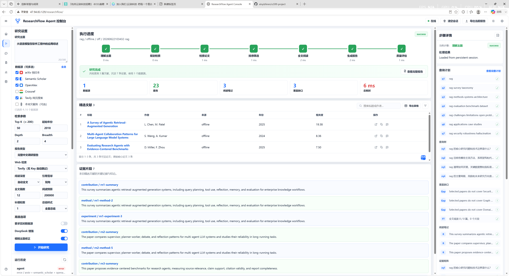
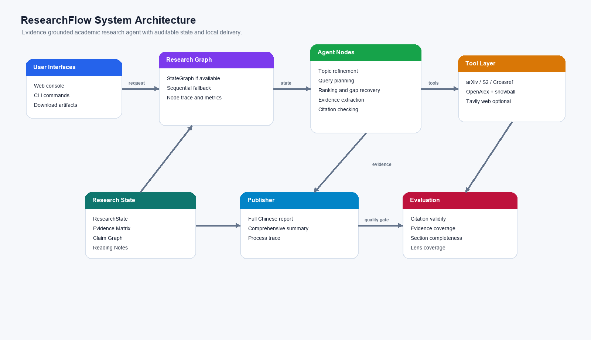
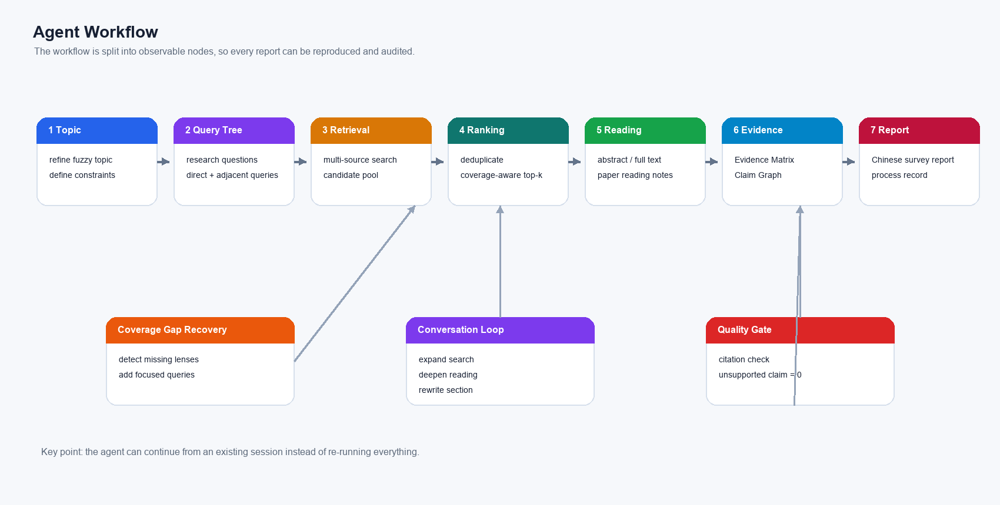
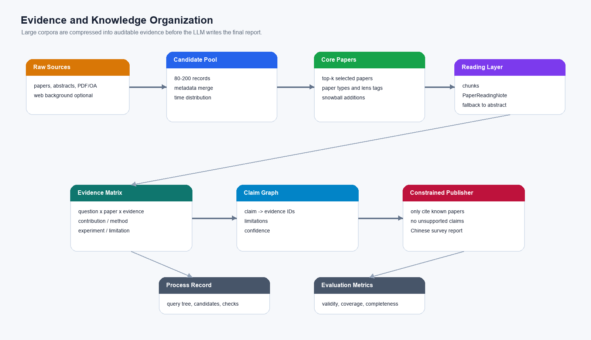

# ResearchFlow

ResearchFlow 是一个证据可追溯的多智能体文献调研 Agent，面向研究生和科研初学者，自动完成论文检索、证据抽取、跨论文综合、引用校验和调研报告生成。

## 项目简介

用户输入研究主题后，ResearchFlow 会规划检索式、调用开放学术数据源获取候选论文，抽取贡献、方法、实验和局限等结构化证据，并生成带来源约束的中文 Markdown 文献调研报告。系统同时输出一份更面向阅读决策的中文综合总结，用来快速了解领域地图、关键共识、主要难点、可信度风险和后续追问方向。

本项目强调“可追溯、可复查、可复现”的 Agentic AI 工作流，避免普通大模型综述中常见的虚假引用和无依据结论。

## Web 控制台预览

ResearchFlow 不只是一个命令行脚本，也提供了本地 Web 控制台：可以配置研究主题、选择多源检索、观察 Agent Trace、查看核心论文与证据、下载完整中文调研报告，并围绕同一份调研继续对话式调整。



## 为什么值得看

- 它不是“让大模型凭空写综述”，而是先做多源检索、证据抽取、引用校验，再生成报告。
- 它不是一次性 skill，而是可恢复 session：生成报告后还能继续对话，要求补搜、精读、过滤和重写。
- 它针对学术调研做了专门优化：OpenAlex 引用雪球、Evidence Matrix、Claim Graph、RAG Research Lens、中文完整综述报告。
- 它保留完整过程记录：检索式、候选池、Top-K、证据账本、引用校验、评估指标都可审计，适合课程演示和复查。

## 系统设计图

### 总体架构



### Agent 工作流



### 证据组织与报告生成



## 方向

方向一：Agentic AI 原生开发。

## 技术栈

- AI IDE: Trae CN
- 语言: Python
- LLM: DeepSeek API / OpenAI API / Ollama 备用
- Agent 框架: LangGraph 可选；无依赖时使用顺序 graph fallback
- 工具调用: arXiv API, Semantic Scholar API, Crossref REST API, OpenAlex Works API, 可选 Tavily Web API
- 存储: SQLite，后续可扩展 Chroma / FAISS
- 测试: pytest
- 容器: Docker
- 版本管理: Git + GitHub

## 核心能力

- Query Planner：将研究主题拆解为检索关键词和检索策略。
- Paper Searcher：从 arXiv、Semantic Scholar、Crossref 等开放学术数据源召回候选论文。
- Paper Ranker：按相关性、年份、引用信息和去重规则筛选 Top-K 文献。
- Corpus Profiler：记录候选池规模、年份分布、近三年/近五年占比和领域覆盖。
- Evidence Extractor：抽取论文贡献、方法、实验、局限和结论。
- Full-Text Reader：可选读取公开 PDF/OA URL，将核心论文切分为 chunk 并生成 PaperReadingNote；失败时回退到摘要级证据。
- Snowball Searcher：基于 OpenAlex 从核心论文扩展参考文献和被引论文，提升深度调研召回。
- Research Synthesizer：生成主题分类、方法对比和研究空白。
- Citation Checker：校验引用元数据与 Claim-Evidence 对齐关系。
- Report Writer：生成结构化 Markdown 调研报告。
- Conversational Session：保存可恢复调研会话，支持在 Web 中继续对话调整范围、补充方向、过滤论文和重写摘要。

## 项目亮点一览

ResearchFlow 的目标不是简单“把搜到的论文总结一下”，而是降低一次领域调研从选题、检索、筛选、阅读、组织到复核的整体成本。当前项目亮点包括：

- 面向学术调研的 Agentic workflow：流程拆成主题修正、query tree、检索、排序、覆盖缺口补搜、引用雪球、全文阅读、证据抽取、综合生成、引用校验和评估节点，便于调试、复现和局部重跑。
- 多源真实检索：支持 arXiv、Semantic Scholar、Crossref、OpenAlex 和可选 Tavily Web；`hybrid` 聚焦学术源，`mixed` 支持学术源加网页背景源。
- 引用网络扩展：基于 OpenAlex 从核心论文继续做 backward references 和 forward citations，缓解只靠关键词检索找不全代表文献的问题。
- 海量资料分层压缩：使用 `paper -> chunks -> PaperReadingNote -> research-question synthesis -> global synthesis` 路径，避免一次性把大量论文塞进大模型上下文。
- Evidence Matrix 与 Claim Graph：报告结论必须绑定证据、论文和引用校验结果，减少幻觉引用和无依据结论。
- 中文完整调研报告：默认输出中文长报告和全面总结，覆盖检索策略、时间分布、方法谱系、核心论文精读、方法对比、评测指标、局限争议和未来方向。
- Evidence-constrained LLM Publisher：完整报告不再只是规则模板整理；DeepSeek 会在 Evidence Matrix、PaperReadingNote、Claim Graph 和引用白名单约束下生成综合性中文长报告，程序会过滤不存在的 paper ref 与 evidence_id。
- 可持续对话调研：每次调研保存 session，后续可继续要求“精读第 3 篇”“补充 benchmark 方向”“删除应用类论文”“重写方法对比”等。
- 无 Key 可演示：DeepSeek、Tavily、Semantic Scholar Key 都是可选增强；无 Key 或联网失败时仍能用离线 fixture 演示完整闭环，并记录 fallback 原因。

## 核心问题与解决方案

### 检索不够完善的问题

已经做的解决方案：

- 关键词不再只靠用户输入：Query Planner 会生成 core、survey、method、benchmark、limitation、application、security、adjacent topic 等多角度 query。
- 模糊主题可修正：启用 `--refine-topic --llm deepseek` 后，会把“RAG 怎么样”这类输入转成更适合学术检索的英文主题，并保留 original topic 与 effective topic。
- 数据源从单一 arXiv 扩展到 `hybrid/mixed`：arXiv 补预印本，Semantic Scholar 补论文图谱，Crossref 补 DOI/出版物元数据，OpenAlex 补开放学术图谱和引用关系。
- 自动发现覆盖缺口：Research Lens 会检查综述、方法、评测、安全、应用等维度是否缺失，并触发一轮 gap recovery query。
- 引用雪球扩展：当核心论文存在 OpenAlex ID 时，系统可沿参考文献和被引论文扩展候选池，把“关键词搜不到但引用网络高度相关”的论文纳入排序。
- 元数据合并与去重：同一论文来自不同源时合并 DOI、arXiv ID、PDF/OA URL、引用数和来源信息，减少重复和缺失。

当前仍未完全解决的限制：

- 公共 API 会限流，Semantic Scholar/arXiv/OpenAlex 在网络不稳定时可能失败；系统能审计和 fallback，但不能保证每次 live demo 都成功。
- 引用雪球目前主要依赖 OpenAlex，可覆盖开放学术图谱，但不等同于商业数据库或人工系统综述的完整召回。
- 网页检索需要 Tavily Key；没有 Key 时 `mixed` 会自动跳过 Web 背景源。
- 目前尚未实现强检索评测集，例如给定领域的 gold survey/reference set，用 Recall@K 或 coverage against gold references 做硬评估。

### 大模型理解和组织海量知识的问题

已经做的解决方案：

- 候选池和核心证据分层：先扩大候选池，再用 coverage-aware ranking 选择核心论文，避免报告直接堆所有搜索结果。
- 摘要级与全文级双路径：`--read-depth abstract` 使用摘要证据；`--read-depth auto/fulltext` 会尝试读取公开 PDF/OA 文本并生成 chunks。
- 分层压缩：每篇论文先形成 PaperReadingNote，再按研究问题综合，最后形成 global synthesis，缓解上下文窗口有限的问题。
- Evidence Matrix：按“研究问题 × 文献 × 证据类型”组织证据，避免报告变成论文列表。
- Claim Graph：把结论、支持证据、局限和置信度连接起来，报告只引用已有 evidence、reading note 或 citation check。
- 调研过程记录：输出 query plan、source coverage、Top-K、Evidence Ledger、Citation Check、metrics 和 fallback，帮助用户判断报告可信度。

当前仍未完全解决的限制：

- 全文解析依赖公开 PDF/OA URL 和可选 `pypdf`，不会也不应该绕过付费墙。
- 规则 fallback 的理解能力有限；DeepSeek 可提升证据抽取和阅读笔记质量，但受 Key、网络、费用和模型 JSON 稳定性影响。
- 当前综合生成主要基于摘要/公开全文文本，尚未实现图表理解、实验表格结构化抽取、公式级比较和多模态 PDF 理解。
- “权威可靠”仍需要人工复核；系统能降低筛选和组织成本，但不替代最终学术判断。

## 任务特有创新

- RAG-aware ranking：针对 RAG 主题提高标题短语、`RAG` 缩写、survey/review/benchmark/security 等信号权重，降低纯领域应用论文误排在前的概率。
- RAG Research Lens：将选中文献映射到 Survey & Taxonomy、Retrieval & Indexing、Generation & Grounding、Evaluation & Benchmarks、Security & Robustness、Graph & Structured RAG、Domain Applications 七个维度。
- Lens coverage：在报告和过程记录中输出 RAG 维度覆盖率和缺失维度，使“研究空白”不只是大模型生成文字，而是可审计的任务特定分析结果。
- Large-corpus compression：先检索较大的候选池，再用时间画像、领域 lens、Top-K 精排和分批 LLM 证据抽取压缩信息，缓解海量资料与上下文窗口有限之间的矛盾。
- Mixed Research Retrieval：`hybrid` 覆盖 arXiv、Semantic Scholar、Crossref、OpenAlex；`mixed` 进一步接入可选 Tavily Web 背景源，在无 Web Key 时自动跳过。
- Query Tree + Gap Recovery：把主题拆成 research questions、subtopics、query tree，并在发现综述/方法/评测/安全等方向缺失时自动补搜一轮。
- Evidence Matrix / Claim Graph：按“研究问题 × 文献 × 证据类型”组织证据，并把 claim、supporting evidence、limitations 和 confidence 显式连接起来。
- Open Full-Text Reading：只读取公开 PDF / OA URL，不绕过付费墙；通过 paper -> chunks -> PaperReadingNote -> question synthesis -> global synthesis 的层级压缩缓解上下文窗口限制。
- OpenAlex Snowball Search：从高相关核心论文出发做 backward references / forward citations 扩展，并把新增候选重新纳入 coverage-aware ranking。
- Full Chinese Report：默认生成完整中文调研报告，章节覆盖检索策略、时间分布、方法谱系、核心论文精读、方法对比、评测指标、结论证据、争议空白和未来方向。
- Fuzzy topic refinement：当用户只给出“RAG 怎么样”这类模糊主题时，可用 DeepSeek 将其修正为英文可检索学术主题，并生成研究问题、相邻主题和查询提示。
- Multi-angle adjacent search：查询计划不只包含完全贴合主题的检索式，还覆盖综述分类、方法系统、评测基准、开放问题、应用案例、安全鲁棒和相邻高相关方向。
- Conversational research loop：把一次性报告升级为可持续调研会话，后续指令会被分类为回答问题、重写报告、调整范围、扩展检索或过滤论文，并记录在过程报告中。

## 目录结构

```text
cs599-project/
├── docs/
│   ├── assets/                               # 架构图、截图、Demo 图片等
│   ├── project_plan.md                       # 项目执行规划
│   ├── researchflow_analysis_architecture.md # 选题分析与系统架构设计
│   ├── product_spec.md                       # Product Spec
│   ├── architecture_spec.md                  # Architecture Spec
│   └── api_spec.md                           # API Spec
├── examples/                                 # Demo 输入、样例报告和离线数据
├── src/
│   └── researchflow/                         # Agent 系统源码
├── tests/                                    # 自动化测试
├── README.md
├── .gitignore
└── LICENSE
```

## 环境搭建

### 1. 创建虚拟环境

```powershell
python -m venv .venv
.\.venv\Scripts\Activate.ps1
```

### 2. 安装依赖

```powershell
pip install -e ".[dev]"
```

### 3. 配置环境变量

不要在代码中硬编码 API Key。请在本地创建 `.env` 文件或通过系统环境变量配置。`.env` 已被 `.gitignore` 忽略，不会提交到 GitHub：

```text
DEEPSEEK_API_KEY=your_deepseek_api_key
OPENAI_API_KEY=your_openai_api_key
SEMANTIC_SCHOLAR_API_KEY=optional_semantic_scholar_api_key
TAVILY_API_KEY=optional_tavily_web_search_key
OPENALEX_MAILTO=optional_email_for_openalex_polite_pool
RESEARCHFLOW_MODEL=deepseek-v4-pro
RESEARCHFLOW_LLM_TIMEOUT=60
```

MVP 阶段允许只使用公开论文 API 和离线样例数据运行基础流程。

### 4. 运行离线 Demo

```powershell
python -m researchflow run "Agentic RAG for enterprise knowledge management" --source offline --top-k 5 --output examples/reports/agentic_rag.md
```

离线模式使用内置样例论文，适合课堂 Demo 和断网兜底。

### 5. 运行真实联网调研报告

```powershell
python -m researchflow run "retrieval augmented generation for large language models" --source arxiv --require-live --top-k 15 --candidate-multiplier 8 --from-year 2020 --output docs/generated_reports/rag_live_literature_review.md --summary-output docs/generated_reports/rag_final_summary.md --process-output docs/generated_reports/rag_live_research_process.md
```

该命令会真实调用 arXiv API，先召回较大的候选池，再筛选核心文献，生成中文最终综合总结、中文 Markdown 文献调研报告和可审计调研过程记录。`--require-live` 会拒绝离线 fallback，避免把离线样例误认为联网调研。`--candidate-multiplier` 控制候选池规模，`--from-year` 控制时效窗口。当前仓库已包含生成样例：

- `docs/generated_reports/rag_live_literature_review.md`
- `docs/generated_reports/rag_final_summary.md`
- `docs/generated_reports/rag_live_research_process.md`

如果 arXiv 请求失败，系统会自动降级到离线样例，并在 metrics 中记录 fallback 原因。

### 6. 运行混合检索

```powershell
python -m researchflow run "agentic literature review agents" --source hybrid --top-k 5 --output docs/generated_reports/hybrid_literature_agents.md
```

`hybrid` 会同时尝试 arXiv、Semantic Scholar、Crossref 和 OpenAlex。arXiv 偏预印本和最新研究，Semantic Scholar 偏论文图谱和引用信息，Crossref 偏正式出版物、DOI 和出版社元数据，OpenAlex 用于补充正式论文、引用数和概念信息。Semantic Scholar 公共接口可能限流；如遇 429，系统会保留错误原因并尝试其他来源或 fallback。

### 6.1 运行 Deep Research 风格 mixed 调研

```powershell
python -m researchflow run "retrieval augmented generation for large language models" --source mixed --web-provider tavily --top-k 12 --max-candidates 120 --from-year 2020 --depth 2 --breadth 4 --report-style full --output docs/generated_reports/rag_mixed_full_report.md --summary-output docs/generated_reports/rag_mixed_summary.md --process-output docs/generated_reports/rag_mixed_process.md
```

`mixed` 表示学术源 + 可选 Web 背景源。若未配置 `TAVILY_API_KEY`，Web 源会自动跳过，不影响 arXiv / Semantic Scholar / Crossref / OpenAlex 调研。完整报告默认是中文长报告，过程记录会展示 query tree、source coverage、coverage gaps、expansion rounds、Evidence Matrix 和 Citation Check。

深度研究增强 Demo：

```powershell
python -m researchflow run "retrieval augmented generation for large language models" --source mixed --web-provider off --require-live --llm deepseek --top-k 12 --max-candidates 120 --from-year 2020 --depth 2 --breadth 4 --report-style full --read-depth auto --max-fulltext-papers 12 --reading-budget-chars 200000 --snowball both --expansion-rounds 1 --summary-style comprehensive --output docs/generated_reports/rag_deep_full_report.md --summary-output docs/generated_reports/rag_deep_summary.md --process-output docs/generated_reports/rag_deep_process.md
```

`--read-depth auto` 会尝试读取公开全文，失败时记录原因并回退摘要；`--snowball both` 会基于 OpenAlex 对核心论文做参考文献和被引论文扩展；`--summary-style comprehensive` 生成更完整的中文综合总结。

### 7. 运行 DeepSeek 增强模式

```powershell
$env:DEEPSEEK_API_KEY="your_deepseek_api_key"
python -m researchflow run "retrieval augmented generation for large language models" --source arxiv --require-live --llm deepseek --top-k 15 --candidate-multiplier 8 --from-year 2020 --output docs/generated_reports/rag_live_literature_review.md --summary-output docs/generated_reports/rag_final_summary.md --process-output docs/generated_reports/rag_live_research_process.md
```

DeepSeek 默认使用 `deepseek-v4-pro`。在完整报告模式下，DeepSeek 会作为 evidence-constrained publisher 生成中文长报告素材，程序再按论文引用白名单和 evidence_id 白名单组装 Markdown，避免模型新增不存在的参考文献；如果模型调用、超时或 JSON 解析失败，系统会自动回退到规则报告，并在 metrics 中记录 `llm_fallback_reason`。过程记录输出的是可审计 Agent 行为，不包含大模型隐藏思考链。

OpenAlex + DeepSeek 轻量 smoke test：

```powershell
python -m researchflow run "retrieval augmented generation for large language models" --source openalex --require-live --llm deepseek --top-k 3 --max-candidates 12 --from-year 2023 --depth 2 --breadth 3 --report-style full --output docs/generated_reports/rag_openalex_deepseek_smoke.md --summary-output docs/generated_reports/rag_openalex_deepseek_summary.md --process-output docs/generated_reports/rag_openalex_deepseek_process.md
```

当前仓库已包含一次成功运行样例：`actual_source=openalex`，`llm_used=true`，用于证明真实学术源检索和 DeepSeek 证据抽取可以闭环。

### 8. 运行模糊主题修正与多角度调研

```powershell
python -m researchflow run "RAG 怎么样" --source hybrid --require-live --llm deepseek --refine-topic --top-k 12 --candidate-multiplier 8 --from-year 2020 --output docs/generated_reports/rag_fuzzy_hybrid_literature_review.md --summary-output docs/generated_reports/rag_fuzzy_hybrid_summary.md --process-output docs/generated_reports/rag_fuzzy_hybrid_process.md
```

`--refine-topic` 会先把模糊主题修正为可检索的学术主题，再生成核心查询、综述查询、方法查询、评测查询、问题查询、应用查询、安全查询和相邻主题查询。过程记录会显示 original topic、effective search topic、research questions、adjacent topics 和每条 query 的 angle/distance。

### 9. 运行 Web 对话式调研控制台

```powershell
python -m researchflow.web --host 127.0.0.1 --port 7860
```

Web 控制台支持初次调研、流程 trace、核心论文/证据查看、Markdown 下载，以及围绕同一份调研继续对话调整。会话会保存到 `data/sessions/{session_id}/`，包括 `state.json`、`messages.jsonl`、`report.md`、`summary.md`、`process.md` 和 `revision_history.jsonl`。当前对话动作包括补充方向、过滤论文、重写摘要、全文精读、引用雪球扩展和方法对比。

### 9.1 云服务器模型与深度报告配置

云服务器部署时，如果希望下载报告走更强的模型综合写作，请在服务器的 `/etc/researchflow.env` 中配置：

```text
RESEARCHFLOW_MODEL=deepseek-v4-pro
RESEARCHFLOW_LLM_TIMEOUT=60
```

修改后重启 ResearchFlow 服务。Web 页面现在默认使用自动全文、双向引用雪球、12 篇全文阅读预算和 20 万字符阅读预算，更适合演示“完整且丰富”的调研报告。

### 10. 运行评估

```powershell
python -m researchflow evaluate --benchmark examples/benchmarks/basic.jsonl --output examples/evaluation/results.json
```

评估会同时生成 `results.json` 和 `results.md`，指标包括综合得分、引用校验通过率、证据覆盖率、报告章节完整率和 Agent 节点 trace 完整度。

## 与 Deep Research / GPT Researcher 的对比

OpenAI Deep Research 强调多步互联网检索、动态转向、阅读网页/PDF/文件并生成带引用的完整报告；官方说明中提到它会搜索、分析、综合大量线上来源，并可根据遇到的信息调整方向。GPT Researcher 则是开源调研 Agent，采用 planner/execution agents 思路，把问题拆成多个 research questions，再抓取、总结、聚合来源；其 Deep Research 模式进一步支持 breadth/depth 递归探索和并发路径。

ResearchFlow 的定位不是复刻通用 Web Research，而是面向课程项目和学术文献调研做一个可审计、可本地运行、可评估的 Research Agent。

| 维度 | ResearchFlow | OpenAI Deep Research | GPT Researcher |
| --- | --- | --- | --- |
| 主要场景 | 学术文献调研、课程作业、中文综述报告 | 通用深度调研、商业/科学/政策/工程等复杂问题 | 通用网页调研和长报告生成 |
| 检索方式 | 学术 API + 可选 Web + OpenAlex 引用雪球 | 浏览器/网页/PDF/文件，多步动态搜索 | Web crawler/retriever，多问题并行检索，Deep Research 递归探索 |
| 知识组织 | Evidence Matrix、Claim Graph、PaperReadingNote、Citation Check | 端到端综合报告，引用来源清晰 | planner 汇总各 execution agents 的来源摘要 |
| 可复现性 | 本地 trace、process.md、metrics、离线 fixture、benchmark | 产品内可查看进度和来源，但内部策略不可完全复现 | 开源，可配置 breadth/depth/retriever/LLM |
| 学术可信约束 | DOI/arXiv/OpenAlex 元数据、claim-evidence 绑定、unsupported claim rate | 强模型能力和来源引用，但内部评估不可直接控制 | 保留来源，但默认更偏网页信息聚合 |
| 中文课程交付 | 原生中文报告、总结、过程记录、课程文档 | 可生成中文，但不是课程项目结构 | 可生成报告，但课程规格需要另行适配 |
| 成本与部署 | 本地 Python 项目，DeepSeek/Tavily 可选，无 Key 也可演示 | 依赖 ChatGPT 产品和额度 | 开源部署，需要配置搜索/LLM/抓取能力 |

ResearchFlow 的相对优势：

- 更适合学术调研：直接接入 arXiv、Semantic Scholar、Crossref、OpenAlex，并把 DOI、arXiv ID、开放 PDF/OA URL 纳入元数据合并。
- 更可审计：不仅输出报告，还输出检索式、候选池、排序、证据台账、引用校验、评估指标和 fallback 原因。
- 更强调证据约束：报告生成不应脱离 Evidence Matrix / Claim Graph，减少“看起来很像综述但引用不可靠”的风险。
- 更适合课程展示：有 Product/Architecture/API Spec、测试、benchmark、中文课程报告和可运行 CLI/Web Demo。
- 更容易局部扩展：引用雪球、全文阅读、对话式精读、过滤论文和重写章节都是明确节点，不需要改整个系统。

ResearchFlow 的不足：

- 通用调研能力弱于 OpenAI Deep Research：目前没有视觉浏览器、图像/表格/电子表格理解，也没有训练过的专用高强度 reasoning agent。
- 检索覆盖弱于成熟商业产品：公共 API 可能限流，开放学术图谱不等价于 Scopus/Web of Science/Google Scholar 的完整覆盖。
- Web 抓取生态弱于 GPT Researcher：Tavily 只是可选来源，尚未实现大规模网页 crawler、JS 渲染抓取和复杂站点解析。
- 全文理解仍是初级版本：可以读取公开 PDF/OA 并 chunk，但章节识别、图表抽取、实验设置抽取和跨论文量化比较还比较粗。
- 评估集还不够强：已有本地 metrics 和 benchmark，但还需要构建领域 gold references，才能严肃评价召回率和报告质量。

因此，目前两个核心问题已经有工程化解决路径，但不是“一劳永逸完全解决”。检索问题通过多源检索、query tree、gap recovery 和 OpenAlex snowball 得到明显缓解；海量知识理解问题通过全文 chunking、PaperReadingNote、分层综合、Evidence Matrix 和 Claim Graph 得到结构化解决。下一步最值得深化的是：构建 gold-standard 学术调研评测集、增强 PDF 章节/表格抽取、加入更稳的网页抓取器，并把 citation graph expansion 做成多轮预算控制的 adaptive retrieval。

## 项目状态

- [x] Proposal
- [x] SDD Specs
- [x] MVP
- [x] Evaluation
- [x] 真实联网文献调研报告样例
- [x] 可审计调研过程记录
- [x] Final Report

## 课程交付要求跟踪

- [x] GitHub 仓库命名为 `cs599-project`
- [x] Public Repository 包含开源协议文件
- [x] 包含 `docs/` 目录
- [x] 包含 `src/` 目录
- [x] 包含 README
- [x] 包含 `.gitignore`
- [x] 包含 Product / Architecture / API Spec 初稿
- [x] 包含本地 benchmark 与评估输出能力
- [x] 包含现场演示脚本 `docs/demo_script.md`
- [x] `docs/CS599_大作业报告.pdf`
- [x] MVP tag: `v0.1`

## 参考资料

- OpenAI Deep Research: <https://openai.com/index/introducing-deep-research/>
- GPT Researcher Introduction: <https://docs.gptr.dev/docs/gpt-researcher/getting-started/introduction>
- GPT Researcher Deep Research: <https://docs.gptr.dev/docs/gpt-researcher/gptr/deep_research>
- Elicit: <https://elicit.com/>
- Semantic Scholar Academic Graph API: <https://www.semanticscholar.org/product/api>
- OpenAlex API: <https://developers.openalex.org/api-reference/introduction>
- arXiv API User Manual: <https://info.arxiv.org/help/api/user-manual.html>
- Crossref REST API: <https://www.crossref.org/documentation/retrieve-metadata/rest-api/>
- Crossref REST API Swagger: <https://api.crossref.org/swagger-ui/index.html>
- LangGraph: <https://langchain-ai.github.io/langgraph/>

## License

This project is licensed under the MIT License.
