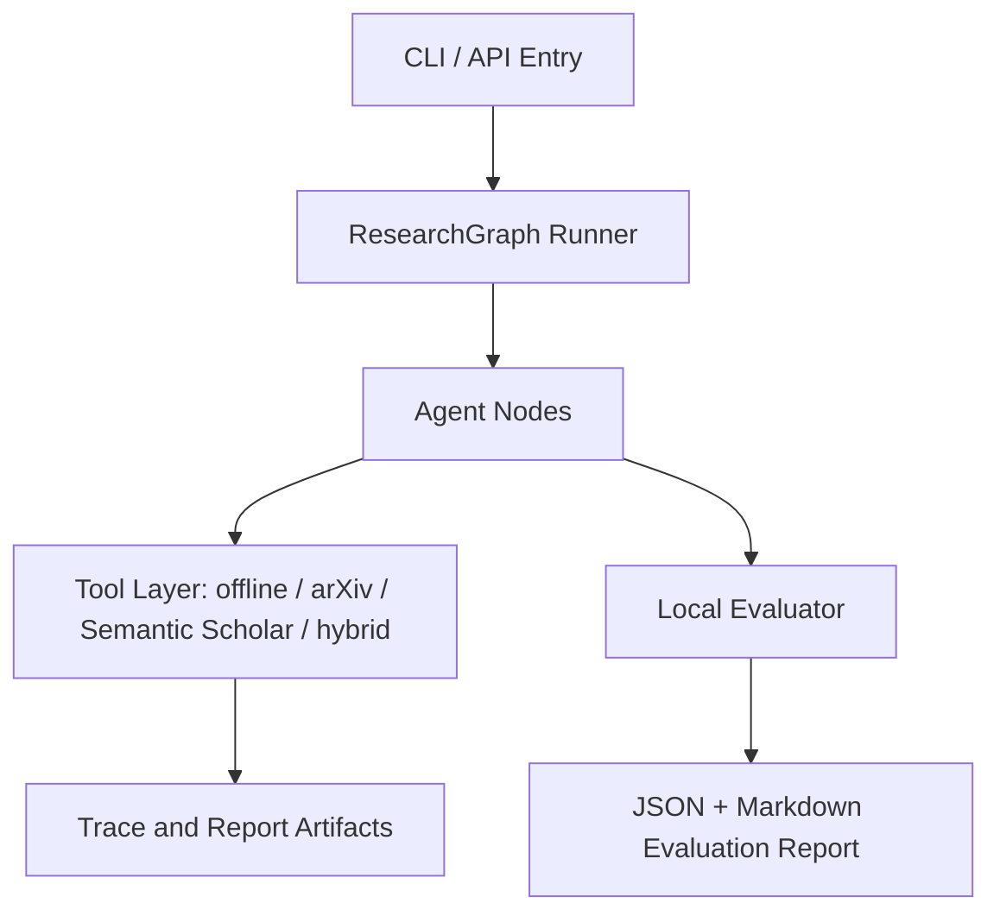
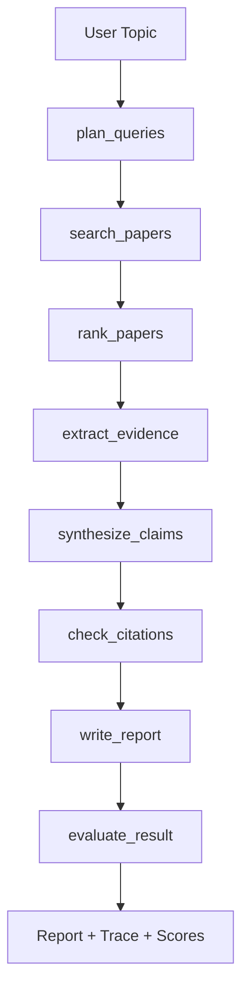

# CS599 期末大作业报告

## 封面

| 字段 | 内容 |
| --- | --- |
| 课程名称 | 企业级应用软件设计与开发 |
| 项目名称 | ResearchFlow：证据可追溯的多智能体文献调研 Agent |
| 方向 | 方向一：Agentic AI 原生开发 |
| 学号 | TODO |
| 姓名 | TODO |
| 专业 | TODO |
| 指导教师 | 戚欣 |
| 提交日期 | 2026 年 6 月 22 日 |

> 注意：最终 PDF 前必须补齐学号、姓名和专业，不得留空。

## 目录

- [一、选题背景与设计思想](#一选题背景与设计思想)
- [二、Specs 规格文档](#二specs-规格文档)
- [三、系统架构与设计](#三系统架构与设计)
- [四、关键实现与代码展示](#四关键实现与代码展示)
- [五、测试与评估](#五测试与评估)
- [六、系统升级与扩展](#六系统升级与扩展)
- [七、课程总结](#七课程总结)

## 一、选题背景与设计思想

### 1.1 问题定义

ResearchFlow 面向研究生、科研初学者和需要快速了解技术领域的开发者。用户输入研究主题后，系统自动完成检索规划、论文检索、相关性筛选、证据抽取、跨论文综合、引用校验和调研报告生成。

系统最终产物包括两类文件：一是面向阅读的文献调研报告，二是面向复现和审计的调研过程记录。后者记录检索式、联网数据源、候选论文、Top-K 筛选、证据台账、Claim-Evidence 对齐、引用校验和评估指标，但不输出大模型隐藏推理链。

传统文献调研通常需要人工完成关键词设计、论文筛选、摘要阅读、方法对比和参考文献整理。普通大模型虽然能快速生成综述文字，但容易出现检索过程不可复现、引用不存在、结论无证据支撑等问题。因此，本项目的核心问题是：

```text
如何让 AI Agent 在给定研究主题后，生成一份结构化、可追溯、引用可信、过程可复现的文献调研报告？
```

### 1.2 现有方案不足

当前已有 Elicit、Consensus、SciSpace、Research Rabbit 等 AI 学术工具，它们证明了“AI + 文献调研”的真实需求。但对于课程项目而言，商业工具通常存在三个不足：

- 工作流黑盒：难以展示系统为什么检索这些论文、如何筛选、如何抽取证据。
- 引用可信度不稳定：生成内容若脱离检索结果，可能出现虚假引用或错误归因。
- 工程闭环不可见：Agent 状态流、工具调用、trace、benchmark 和评估指标通常无法直接观察。

### 1.3 项目价值

ResearchFlow 将文献调研拆解为可追踪的 Agent 节点，先构建 Evidence Ledger，再生成报告。报告中的关键结论必须绑定 `claim_id` 和 `evidence_id`，引用必须来自候选论文集合，从而降低幻觉风险。

项目价值体现在：

- 对学习者：帮助快速进入新研究方向。
- 对工程实践：展示 Agentic AI 原生开发流程。
- 对课程评分：覆盖 SDD、工具调用、状态管理、多步骤推理、评估与可观测性。
- 对扩展研究：为后续接入 MCP、全文解析、引用图谱和长期主题追踪打基础。

### 1.4 技术路线

技术路线如下：

```text
研究主题
→ Query Planner
→ Paper Searcher
→ Paper Ranker
→ Evidence Extractor
→ Research Synthesizer
→ Citation Checker
→ Report Writer
→ Evaluator
```

当前实现支持离线样例数据、arXiv API、Semantic Scholar API 和 hybrid 多源检索；DeepSeek 作为可选增强，用于证据抽取和报告背景段落润色。无 API Key 时系统仍可稳定运行。

## 二、Specs 规格文档

本项目采用 SDD（规格驱动开发）方法，先定义产品目标、架构约束和接口契约，再按规格实现代码。

### 2.1 Product Spec

Product Spec 位于 `docs/product_spec.md`，主要定义：

- 目标用户：研究生、科研初学者、企业研发人员、课程评审。
- MVP 范围：输入主题、检索候选论文、筛选 Top-K、抽取证据、生成 Markdown 报告。
- Final 范围：多源检索、引用校验、SQLite 记忆库、benchmark 评估、课程报告 PDF。
- 成功指标：检索成功率、报告章节完整率、引用来自候选论文比例、引用校验通过率。

### 2.2 Architecture Spec

Architecture Spec 位于 `docs/architecture_spec.md`，主要定义：

- 分层架构：CLI/API Entry、ResearchGraph、Agent Nodes、Tool Layer、Storage、Evaluation。
- 状态模型：`ResearchState` 保存 topic、query_plan、papers、evidence、claims、citation_checks、report、metrics。
- 降级策略：LangGraph 不可用时使用 sequential fallback；DeepSeek 不可用时使用规则抽取。

### 2.3 API Spec

API Spec 位于 `docs/api_spec.md`，主要定义：

- CLI：`researchflow run`、`researchflow evaluate`、`researchflow version`。
- 参数：`--source offline|arxiv|semantic_scholar|hybrid`、`--llm off|deepseek`、`--top-k`、`--output`。
- 数据 Schema：`PaperRecord`、`EvidenceItem`、`ClaimRecord`、`CitationCheck`。
- 评估指标：`overall_score`、`citation_check_pass_rate`、`claim_evidence_coverage`、`report_section_completeness`。

## 三、系统架构与设计

### 3.1 总体架构

系统采用分层架构：

```text
CLI/API Entry
→ ResearchGraph Runner
→ Agent Nodes
→ Tool Layer
→ Trace and Report Artifacts
→ Local Evaluator
```

架构图源码位于 `docs/assets/architecture.mmd`。



### 3.2 Agent 交互流程

Agent 流程图源码位于 `docs/assets/agent_flow.mmd`。



### 3.3 数据流设计

数据流图源码位于 `docs/assets/data_flow.mmd`。

```mermaid
flowchart LR
    Topic["Topic"] --> Query["Query Plan"]
    Query --> Papers["Searched Papers"]
    Papers --> Selected["Selected Papers"]
    Selected --> Evidence["Evidence Ledger"]
    Evidence --> Claims["Claim Records"]
    Claims --> Checks["Citation Checks"]
    Checks --> Report["Markdown Report"]
    Report --> Metrics["Evaluation Metrics"]
```



### 3.4 核心状态

系统核心状态为 `ResearchState`，主要字段包括：

- `topic`：用户研究主题。
- `query_plan`：检索计划。
- `searched_papers` / `selected_papers`：候选论文与筛选论文。
- `evidence_items`：证据账本。
- `claims`：报告关键结论。
- `citation_checks`：引用与证据校验结果。
- `node_trace`：Agent 节点执行 trace。
- `metrics`：评估指标。

## 四、关键实现与代码展示

### 4.1 Agent 核心循环

核心流程位于 `src/researchflow/pipeline.py`。系统把原始 pipeline 拆成多个节点：

```python
RESEARCH_NODES = [
    ("plan_queries", node_plan_queries),
    ("search_papers", node_search_papers),
    ("rank_papers", node_rank_papers),
    ("extract_evidence", node_extract_evidence),
    ("synthesize_claims", node_synthesize_claims),
    ("check_citations", node_check_citations),
    ("write_report", node_write_report),
    ("evaluate_result", node_evaluate_result),
]
```

### 4.2 Graph Runner

`src/researchflow/graph.py` 提供两种运行方式：

- LangGraph 可用时，使用 `StateGraph` 编排节点。
- LangGraph 不可用时，使用 sequential fallback，保证课堂 Demo 稳定。

这种设计让项目同时满足“Agentic AI 状态流”与“无依赖可演示”的要求。

### 4.3 工具定义

当前工具包括：

- `search_arxiv`：调用 arXiv API 并解析 Atom XML。
- `search_semantic_scholar`：调用 Semantic Scholar Academic Graph API 并解析 JSON。
- `hybrid`：合并 arXiv 与 Semantic Scholar 的候选论文，统一去重、排序和 fallback。
- `search_offline`：使用离线样例数据，保证断网 Demo。
- `DeepSeekClient`：可选 LLM 客户端，只从环境变量读取 Key。

DeepSeek 不可用时，系统自动降级，不影响主流程。

### 4.4 引用与证据约束

报告不是直接由 LLM 从主题生成，而是基于 Evidence Ledger：

- 每个 `EvidenceItem` 绑定 `paper_id`。
- 每个 `ClaimRecord` 绑定一个或多个 `evidence_id`。
- `CitationChecker` 只允许引用候选论文中的文献。
- Evaluator 统计 unsupported claim rate 和 hallucinated reference count。

### 4.5 RAG Research Lens 创新

针对 RAG 调研任务，本项目加入了任务特定的 RAG Research Lens。该模块不是通用摘要模板，而是把 RAG 文献映射到 Survey & Taxonomy、Retrieval & Indexing、Generation & Grounding、Evaluation & Benchmarks、Security & Robustness、Graph & Structured RAG、Domain Applications 七个维度。

该设计带来三个改进：

- RAG-aware ranking：提高标题中的 Retrieval-Augmented Generation、RAG、survey、review、benchmark、security 等信号权重，减少纯领域应用论文被误排到核心位置。
- Lens coverage：输出 RAG 维度覆盖率和缺失维度，让调研报告能说明“当前选文覆盖了哪些方向，还缺哪些方向”。
- Gap grounding：研究空白不只由 LLM 直接生成，而可以结合 lens coverage、Evidence Ledger 和 Citation Check 共同判断。

### 4.6 配置安全

API Key 不写入代码和仓库，只通过环境变量读取：

```powershell
$env:DEEPSEEK_API_KEY="your_deepseek_api_key"
```

`.gitignore` 排除了 `.env` 和 `.env.*`，防止本地密钥进入 GitHub。

## 五、测试与评估

### 5.1 测试用例

当前测试包括：

- arXiv XML 解析测试。
- 离线 pipeline 生成报告测试。
- evaluator 输出评分测试。
- DeepSeek 无 Key fallback 测试。
- LLM JSON 解析和证据抽取测试。

运行命令：

```powershell
$env:PYTHONPATH="src"
python -m pytest tests
```

当前结果：

```text
10 passed
```

### 5.2 评估标准

本项目采用 100 分制综合评估：

| 维度 | 权重 | 指标 |
| --- | ---: | --- |
| 任务完成 | 20 | run success rate、report generated、node failure recovery |
| 检索质量 | 20 | Top-K relevance、duplicate rate、source success rate |
| 证据可信 | 25 | citation validity、claim evidence coverage、unsupported claim rate |
| 报告质量 | 20 | section completeness、method taxonomy quality、research gap usefulness、research lens coverage |
| Agent 行为 | 15 | tool call correctness、plan adherence、trace completeness |

评估方案见 `docs/evaluation_plan.md`。

### 5.3 Benchmark 结果

benchmark 文件为 `examples/benchmarks/basic.jsonl`，包含 5 个主题：

1. Agentic RAG for enterprise knowledge management
2. Multi-agent collaboration in LLM systems
3. LLM agents for software engineering
4. Citation hallucination detection in scientific writing
5. Long-term memory mechanisms for LLM agents

运行命令：

```powershell
$env:PYTHONPATH="src"
python -m researchflow evaluate --benchmark examples/benchmarks/basic.jsonl --output examples/evaluation/results.json
```

当前离线 benchmark 结果：

| 指标 | 结果 |
| --- | ---: |
| task_count | 5 |
| success_count | 5 |
| average_score | 100.0 |
| citation_check_pass_rate | 1.0 |
| claim_evidence_coverage | 1.0 |
| report_section_completeness | 1.0 |
| research_lens_coverage | RAG 任务样例为 1.0 |

### 5.4 Demo 说明

离线 Demo：

```powershell
$env:PYTHONPATH="src"
python -m researchflow run "Agentic RAG for enterprise knowledge management" --source offline --top-k 5
```

arXiv Demo：

```powershell
$env:PYTHONPATH="src"
python -m researchflow run "large language model agents" --source arxiv --top-k 5
```

真实联网调研报告样例：

```powershell
$env:PYTHONPATH="src"
python -m researchflow run "retrieval augmented generation for large language models" --source arxiv --require-live --top-k 8 --output docs/generated_reports/rag_live_literature_review.md --process-output docs/generated_reports/rag_live_research_process.md
```

已生成样例包括：`docs/generated_reports/rag_live_literature_review.md` 和 `docs/generated_reports/rag_live_research_process.md`。该样例要求 `actual_source` 为 `arxiv`，引用均来自真实 arXiv URL。

DeepSeek 增强 Demo：

```powershell
$env:DEEPSEEK_API_KEY="your_deepseek_api_key"
$env:PYTHONPATH="src"
python -m researchflow run "retrieval augmented generation for large language models" --source arxiv --require-live --llm deepseek --top-k 8 --output docs/generated_reports/rag_live_literature_review.md --process-output docs/generated_reports/rag_live_research_process.md
```

## 六、系统升级与扩展

### 6.1 短期扩展

- 增强 Semantic Scholar 的限流恢复策略，支持用户提供 API Key 后提升稳定性。
- 接入 Crossref，增强 DOI 和出版元数据校验。
- 增加 SQLite 记忆库，保存历史任务、论文、证据和报告。
- 完成最终 PDF 生成，并保证导航目录可用。

### 6.2 中期扩展

- 支持开放获取全文解析，从摘要级证据升级到段落级证据。
- 增加 Human-in-the-loop，让用户审核候选论文和关键 claim。
- 增加可视化 trace 页面，展示每个 Agent 节点输入输出。

### 6.3 长期扩展

- 将论文检索与证据抽取能力暴露为 MCP Server。
- 支持研究主题长期追踪，自动发现新论文。
- 构建引用网络和主题演化图谱。

## 七、课程总结

通过 ResearchFlow 的设计和实现，我对 Agentic AI 原生开发形成了更具体的理解：重点不只是调用大模型生成文本，而是把复杂任务拆成可验证、可恢复、可观测的工作流。

本项目中的工程思维转变主要体现在：

- 从“写一个函数完成任务”转向“编排多个 Agent 节点协作”。
- 从“相信模型输出”转向“先检索证据，再约束生成”。
- 从“演示一次成功结果”转向“用 benchmark 和 metrics 评估系统稳定性”。
- 从“功能实现”转向“规格、架构、代码、测试、报告的一体化闭环”。

后续如果继续完善，我会优先增强真实数据源、全文解析和人工审核机制，使 ResearchFlow 更接近可用于真实科研辅助的系统。
