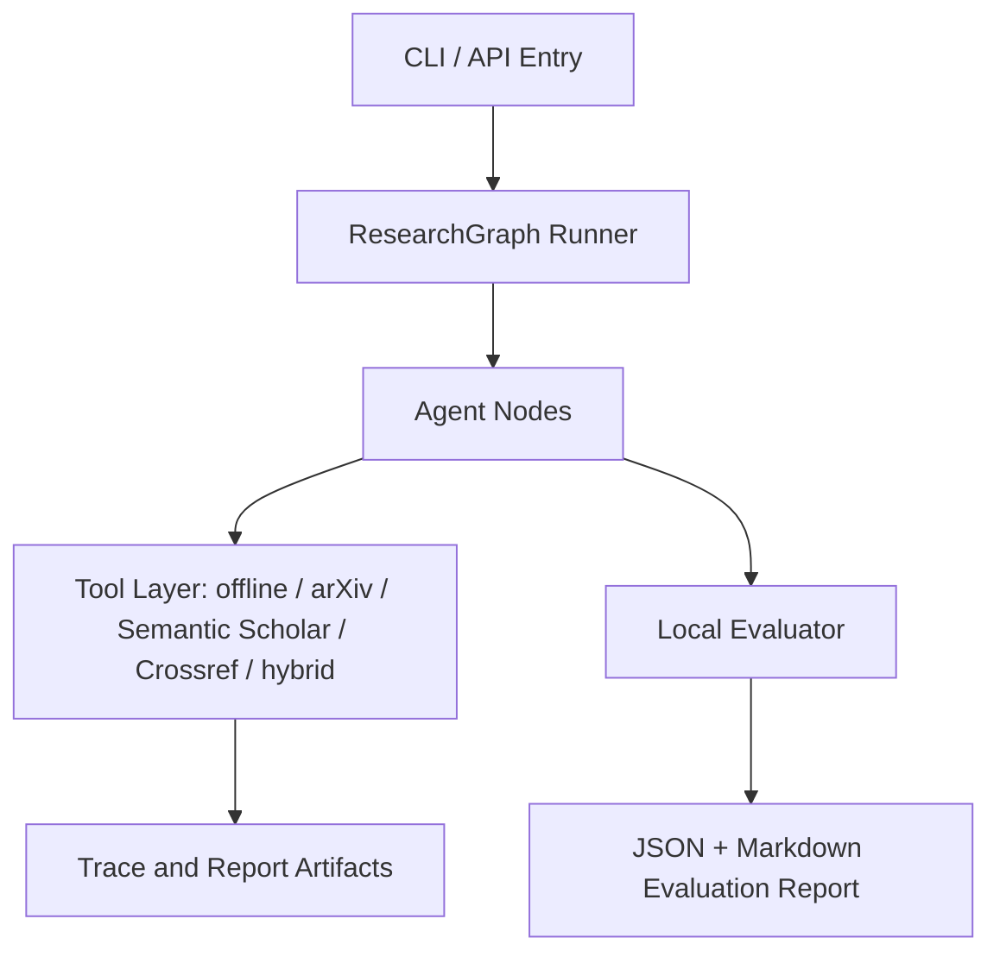
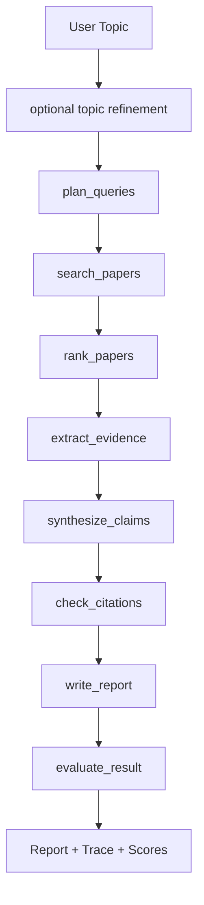

# CS599 期末大作业报告

## 封面

| 字段 | 内容 |
| --- | --- |
| 课程名称 | 企业级应用软件设计与开发 |
| 项目名称 | ResearchFlow：证据可追溯的多智能体文献调研 Agent |
| 方向 | 方向一：Agentic AI 原生开发 |
| 学号 | 2025303015 |
| 姓名 | 欧阳玉宋 |
| 专业 | 软件工程 |
| 指导教师 | 戚欣 |
| 提交日期 | 2026 年 6 月 22 日 |

> 注意：最终 PDF 前需再次核对封面信息、目录和截图材料。

## 目录

- [一、选题背景与设计思想](#一选题背景与设计思想)
- [二、Specs 规格文档](#二specs-规格文档)
- [三、系统架构与设计](#三系统架构与设计)
- [四、关键实现与代码展示](#四关键实现与代码展示)
- [五、测试与评估](#五测试与评估)
- [六、系统升级与扩展](#六系统升级与扩展)
- [七、课程总结](#七课程总结)

## 一、选题背景与设计思想

### 1.1 问题定义

ResearchFlow 面向研究生、科研初学者和需要快速了解技术领域的开发者。用户输入研究主题后，系统自动完成检索规划、论文检索、相关性筛选、证据抽取、跨论文综合、引用校验和调研报告生成。

系统最终产物包括三类文件：一是面向快速决策的中文综合总结，二是面向展开阅读的中文完整文献调研报告，三是面向复现和审计的调研过程记录。综合总结不仅罗列论文，还会压缩成调研范围、核心问题、一句话结论、关键发现、分层结论、技术脉络、阅读路线、主要难点、可信度风险和工程建议；过程记录则保留检索式、联网数据源、候选论文、Top-K 筛选、候选池年份分布、领域覆盖、证据台账、Claim-Evidence 对齐、引用校验和评估指标，但不输出大模型隐藏推理链。

为避免系统停留在“一次性生成报告”的 skill 形态，当前版本进一步加入 Conversational Research Session。初次调研完成后，用户可以在 Web 控制台继续对话，要求补充某个方向、排除某类论文、调整时间范围或重写摘要；系统会把后续指令分类为可审计 action，并基于已有 state 局部更新报告和过程记录。

传统文献调研通常需要人工完成关键词设计、论文筛选、摘要阅读、方法对比和参考文献整理。普通大模型虽然能快速生成综述文字，但容易出现检索过程不可复现、引用不存在、结论无证据支撑等问题。因此，本项目的核心问题是：

```text
如何让 AI Agent 在给定研究主题后，生成一份结构化、可追溯、引用可信、过程可复现的文献调研报告？
```

### 1.2 现有方案不足

当前已有 Elicit、Consensus、SciSpace、Research Rabbit 等 AI 学术工具，它们证明了“AI + 文献调研”的真实需求。但对于课程项目而言，商业工具通常存在三个不足：

- 工作流黑盒：难以展示系统为什么检索这些论文、如何筛选、如何抽取证据。
- 引用可信度不稳定：生成内容若脱离检索结果，可能出现虚假引用或错误归因。
- 工程闭环不可见：Agent 状态流、工具调用、trace、benchmark 和评估指标通常无法直接观察。

### 1.3 项目价值

ResearchFlow 将文献调研拆解为可追踪的 Agent 节点，先构建 Evidence Ledger，再生成报告。报告中的关键结论必须绑定 `claim_id` 和 `evidence_id`，引用必须来自候选论文集合，从而降低幻觉风险。

项目价值体现在：

- 对学习者：帮助快速进入新研究方向。
- 对工程实践：展示 Agentic AI 原生开发流程。
- 对课程评分：覆盖 SDD、工具调用、状态管理、多步骤推理、评估与可观测性。
- 对扩展研究：为后续接入 MCP、全文解析、引用图谱和长期主题追踪打基础。

### 1.4 技术路线

技术路线如下：

```text
研究主题
→ Query Planner
→ Paper Searcher
→ Paper Ranker
→ Evidence Extractor
→ Research Synthesizer
→ Citation Checker
→ Report Writer
→ Evaluator
```

当前实现支持离线样例数据、arXiv API、Semantic Scholar API、Crossref REST API 和 hybrid 多源检索；DeepSeek 作为可选增强，用于模糊主题修正、证据抽取和报告背景段落润色。无 API Key 时系统仍可稳定运行。

## 二、Specs 规格文档

本项目采用 SDD（规格驱动开发）方法，先定义产品目标、架构约束和接口契约，再按规格实现代码。

### 2.1 Product Spec

Product Spec 位于 `docs/product_spec.md`，主要定义：

- 目标用户：研究生、科研初学者、企业研发人员、课程评审。
- MVP 范围：输入主题、检索候选论文、筛选 Top-K、抽取证据、生成 Markdown 报告。
- Final 范围：多源检索、引用校验、SQLite 记忆库、benchmark 评估、课程报告 PDF。
- 成功指标：检索成功率、报告章节完整率、引用来自候选论文比例、引用校验通过率。

### 2.2 Architecture Spec

Architecture Spec 位于 `docs/architecture_spec.md`，主要定义：

- 分层架构：CLI/API Entry、ResearchGraph、Agent Nodes、Tool Layer、Storage、Evaluation。
- 状态模型：`ResearchState` 保存 topic、query_plan、papers、evidence、claims、citation_checks、report、metrics。
- 降级策略：LangGraph 不可用时使用 sequential fallback；DeepSeek 不可用时使用规则抽取。

### 2.3 API Spec

API Spec 位于 `docs/api_spec.md`，主要定义：

- CLI：`researchflow run`、`researchflow evaluate`、`researchflow version`。
- 参数：`--source offline|arxiv|semantic_scholar|crossref|hybrid`、`--llm off|deepseek`、`--refine-topic`、`--top-k`、`--output`。
- 数据 Schema：`PaperRecord`、`EvidenceItem`、`ClaimRecord`、`CitationCheck`。
- 评估指标：`overall_score`、`citation_check_pass_rate`、`claim_evidence_coverage`、`report_section_completeness`。

## 三、系统架构与设计

### 3.1 总体架构

系统采用分层架构：

```text
CLI/API Entry
→ ResearchGraph Runner
→ Agent Nodes
→ Tool Layer
→ Trace and Report Artifacts
→ Local Evaluator
```

架构图源码位于 `docs/assets/architecture.mmd`。



### 3.2 Agent 交互流程

Agent 流程图源码位于 `docs/assets/agent_flow.mmd`。



### 3.3 数据流设计

数据流图源码位于 `docs/assets/data_flow.mmd`。

```mermaid
flowchart LR
    Topic["Topic"] --> Query["Query Plan"]
    Query --> Papers["Searched Papers"]
    Papers --> Selected["Selected Papers"]
    Selected --> Evidence["Evidence Ledger"]
    Evidence --> Claims["Claim Records"]
    Claims --> Checks["Citation Checks"]
    Checks --> Report["Markdown Report"]
    Report --> Metrics["Evaluation Metrics"]
```



### 3.4 核心状态

系统核心状态为 `ResearchState`，主要字段包括：

- `topic`：用户研究主题。
- `effective_topic`：经过可选主题修正后实际用于检索、排序和报告生成的主题。
- `topic_refinement`：主题修正结果，包括 refined topic、research questions、adjacent topics 和 query hints。
- `query_plan`：检索计划。
- `searched_papers` / `selected_papers`：候选论文与筛选论文。
- `evidence_items`：证据账本。
- `claims`：报告关键结论。
- `citation_checks`：引用与证据校验结果。
- `node_trace`：Agent 节点执行 trace。
- `metrics`：评估指标。
- `conversation_messages`：围绕当前调研继续对话的消息记录。
- `revision_history`：每次对话调整产生的 action、受影响字段和更新时间。

## 四、关键实现与代码展示

### 4.1 Agent 核心循环

核心流程位于 `src/researchflow/pipeline.py`。系统把原始 pipeline 拆成多个节点：

```python
RESEARCH_NODES = [
    ("plan_queries", node_plan_queries),
    ("search_papers", node_search_papers),
    ("rank_papers", node_rank_papers),
    ("expand_search", node_expand_search),
    ("extract_evidence", node_extract_evidence),
    ("synthesize_claims", node_synthesize_claims),
    ("check_citations", node_check_citations),
    ("write_report", node_write_report),
    ("evaluate_result", node_evaluate_result),
]
```

### 4.2 Graph Runner

`src/researchflow/graph.py` 提供两种运行方式：

- LangGraph 可用时，使用 `StateGraph` 编排节点。
- LangGraph 不可用时，使用 sequential fallback，保证课堂 Demo 稳定。

这种设计让项目同时满足“Agentic AI 状态流”与“无依赖可演示”的要求。

### 4.3 工具定义

当前工具包括：

- `search_arxiv`：调用 arXiv API 并解析 Atom XML。
- `search_semantic_scholar`：调用 Semantic Scholar Academic Graph API 并解析 JSON。
- `search_crossref`：调用 Crossref REST API，补充正式出版物、DOI 和出版社元数据。
- `hybrid`：合并 arXiv、Semantic Scholar 与 Crossref 的候选论文，统一去重、排序和 fallback。
- `search_offline`：使用离线样例数据，保证断网 Demo。
- `DeepSeekClient`：可选 LLM 客户端，只从环境变量读取 Key，用于主题修正、证据抽取和报告润色。

DeepSeek 不可用时，系统自动降级，不影响主流程。

### 4.4 引用与证据约束

报告不是直接由 LLM 从主题生成，而是基于 Evidence Ledger：

- 每个 `EvidenceItem` 绑定 `paper_id`。
- 每个 `ClaimRecord` 绑定一个或多个 `evidence_id`。
- `CitationChecker` 只允许引用候选论文中的文献。
- Evaluator 统计 unsupported claim rate 和 hallucinated reference count。

### 4.5 RAG Research Lens 创新

针对 RAG 调研任务，本项目加入了任务特定的 RAG Research Lens。该模块不是通用摘要模板，而是把 RAG 文献映射到 Survey & Taxonomy、Retrieval & Indexing、Generation & Grounding、Evaluation & Benchmarks、Security & Robustness、Graph & Structured RAG、Domain Applications 七个维度。

该设计带来三个改进：

- RAG-aware ranking：提高标题中的 Retrieval-Augmented Generation、RAG、survey、review、benchmark、security 等信号权重，减少纯领域应用论文被误排到核心位置。
- Lens coverage：输出 RAG 维度覆盖率和缺失维度，让调研报告能说明“当前选文覆盖了哪些方向，还缺哪些方向”。
- Gap grounding：研究空白不只由 LLM 直接生成，而可以结合 lens coverage、Evidence Ledger 和 Citation Check 共同判断。

### 4.6 模糊主题修正与多角度查询创新

真实用户往往不会输入严格的学术检索式，而会输入“RAG 怎么样”“Agent 能不能帮我写代码”这类模糊问题。直接检索这类输入会导致关键词过短、语义不稳定、结果偏窄。ResearchFlow 因此增加了可选的 `--refine-topic` 节点：

- 主题修正：当启用 `--llm deepseek --refine-topic` 时，系统先把用户原始主题修正为英文可检索学术主题，并保留 original topic 与 effective topic。
- 研究问题生成：系统生成 3-5 个 research questions，帮助后续报告围绕问题组织，而不是简单罗列论文。
- 相邻主题扩展：系统生成 adjacent topics，例如 RAG 主题会扩展到 citation hallucination、context compression、evaluation benchmark、security robustness 等高相关方向。
- 多角度查询：Query Planner 输出 core、survey_taxonomy、methods_systems、evaluation_benchmark、limitations_challenges、applications_domains、security_robustness、adjacent_topic 等 angle，并在过程记录中标注 direct/adjacent distance。
- 可审计降级：若 LLM 不可用，系统回到规则查询，并在 `topic_refinement_fallback_reason` 中记录原因。

该创新的价值是降低选题澄清成本。用户不需要一开始就知道精确关键词，Agent 会先把模糊主题转化为可执行调研计划，再通过多源检索扩大观察面。

### 4.7 大规模信息压缩与时效控制

文献调研的主要矛盾不是生成摘要，而是如何在海量资料中形成可信、可复核的领域理解。为此，ResearchFlow 增加了候选池与核心证据层的两级设计：

- 候选池扩展：通过 `--candidate-multiplier` 或 `--max-candidates` 扩大检索候选集，先建立更大的领域观察面。
- 时间窗口：通过 `--from-year` 控制资料起始年份，并在过程记录和 metrics 中输出最早年份、最新年份、近三年占比和近五年占比。
- 领域覆盖：对候选池和核心文献分别运行 RAG Research Lens，避免只根据少量 Top-K 文献判断整个领域。
- 上下文压缩：LLM 不一次读取全部资料，而是按批次从核心文献抽取 EvidenceItem；候选池用于覆盖画像，核心文献用于可追溯证据。
- 可靠输出：最终报告只使用 Evidence Ledger、Citation Check 和真实 URL 支撑关键结论。

### 4.8 对标 DeepResearch / GPT Researcher 与本项目突破

DeepResearch 和 GPT Researcher 代表了当前“自动调研 Agent”的两类重要思路：前者强调多步搜索、动态转向、阅读网页/PDF/文件并生成带引用的完整报告；后者强调 planner、execution、publisher 的分工，以及可配置 depth/breadth 的树状递归探索。ResearchFlow 吸收了这两类系统的优点，但没有直接复刻通用网页调研路线，而是把创新点聚焦在课程项目更可验证的“学术调研”场景。

本项目的差异化主要体现在六点。第一，检索召回从单源 arXiv 扩展为 Mixed Research Retrieval，`hybrid` 覆盖 arXiv、Semantic Scholar、Crossref、OpenAlex，`mixed` 进一步支持可选 Tavily Web 背景源。第二，查询规划从平铺 query list 升级为 research questions、subtopics、query tree，并通过 coverage gap detector 自动补搜缺失方向。第三，引入 OpenAlex Snowball Search，从核心论文出发沿 backward references 和 forward citations 扩展候选池，缓解“只搜关键词找不全”的问题。第四，大规模信息理解不依赖一次性把所有材料塞进 LLM，而是采用 paper -> chunks -> PaperReadingNote -> research-question synthesis -> global synthesis 的层级压缩路径。第五，Evidence Matrix 与 Claim Graph 使报告按研究问题、方法谱系和证据关系组织，而不是按论文顺序堆叠。第六，最终产物从“论文列表式摘要”升级为完整中文调研报告，包含检索策略、时间分布、方法分类、核心论文精读、方法对比、评测指标、主要结论与证据、争议局限、未来方向和附录。

这种设计解决了本任务中最核心的矛盾：文献数量很大、来源质量不均、用户主题可能模糊，而大模型上下文和可信度有限。ResearchFlow 的策略是先扩大候选池和来源覆盖，再用结构化压缩把大量信息变成可审计证据，最后只允许报告引用 Evidence Matrix / Claim Graph 中已有的证据。这使系统更像一个可持续对话的 Research Agent，而不是一次性写作 skill。

### 4.9 配置安全

API Key 不写入代码和仓库，只通过环境变量读取：

```powershell
$env:DEEPSEEK_API_KEY="your_deepseek_api_key"
```

`.gitignore` 排除了 `.env` 和 `.env.*`，防止本地密钥进入 GitHub。

### 4.10 对话式调研会话

系统新增 Conversation Controller 和本地 Session Store。每次调研完成后，系统会在 `data/sessions/{session_id}/` 保存 `state.json`、`messages.jsonl`、`report.md`、`summary.md`、`process.md` 和 `revision_history.jsonl`。Web 端通过 `POST /api/runs/{id}/messages` 接收后续调整请求。

当前支持的 action 包括：

- `answer_question`：基于当前 evidence、核心论文和 metrics 回答问题。
- `rewrite_report`：不重新检索，只改写 summary/report 表达。
- `adjust_scope`：调整年份等范围后局部重排和重写。
- `expand_search`：追加某个研究角度的 query，增量检索并刷新报告。
- `filter_papers`：排除应用类或指定论文，重新生成证据、结论和引用检查。

这种设计让 ResearchFlow 从“一次性调研 skill”升级为可持续对话 Agent：它维护会话状态、记住用户约束、记录每次修改，并保持所有输出仍受 Evidence Ledger 和 Citation Check 约束。

## 五、测试与评估

### 5.1 测试用例

当前测试包括：

- arXiv XML 解析测试。
- 离线 pipeline 生成报告测试。
- evaluator 输出评分测试。
- DeepSeek 无 Key fallback 测试。
- 模糊主题修正与多角度查询计划测试。
- LLM JSON 解析和证据抽取测试。
- OpenAlex 元数据解析、公开 PDF/OA URL 提取与引用雪球相关测试。
- 全文 chunking、PaperReadingNote fallback、阅读证据生成测试。
- 对话式精读、引用雪球扩展和方法对比 action 测试。

运行命令：

```powershell
$env:PYTHONPATH="src"
python -m pytest tests
```

当前结果：

```text
40 passed
```

### 5.2 评估标准

本项目采用 100 分制综合评估：

| 维度 | 权重 | 指标 |
| --- | ---: | --- |
| 任务完成 | 20 | run success rate、report generated、node failure recovery |
| 检索质量 | 20 | Top-K relevance、duplicate rate、source success rate |
| 证据可信 | 25 | citation validity、claim evidence coverage、unsupported claim rate |
| 报告质量 | 20 | section completeness、method taxonomy quality、research gap usefulness、research lens coverage |
| Agent 行为 | 15 | tool call correctness、plan adherence、trace completeness |

评估方案见 `docs/evaluation_plan.md`。

### 5.3 Benchmark 结果

benchmark 文件为 `examples/benchmarks/basic.jsonl`，包含 5 个主题：

1. Agentic RAG for enterprise knowledge management
2. Multi-agent collaboration in LLM systems
3. LLM agents for software engineering
4. Citation hallucination detection in scientific writing
5. Long-term memory mechanisms for LLM agents

运行命令：

```powershell
$env:PYTHONPATH="src"
python -m researchflow evaluate --benchmark examples/benchmarks/basic.jsonl --output examples/evaluation/results.json
```

当前离线 benchmark 结果：

| 指标 | 结果 |
| --- | ---: |
| task_count | 5 |
| success_count | 5 |
| average_score | 99.2 |
| citation_check_pass_rate | 1.0 |
| claim_evidence_coverage | 1.0 |
| report_section_completeness | 1.0 |
| research_lens_coverage | RAG 任务样例为 1.0 |

### 5.4 Demo 说明

离线 Demo：

```powershell
$env:PYTHONPATH="src"
python -m researchflow run "Agentic RAG for enterprise knowledge management" --source offline --top-k 5
```

arXiv Demo：

```powershell
$env:PYTHONPATH="src"
python -m researchflow run "large language model agents" --source arxiv --top-k 5
```

真实联网调研报告样例：

```powershell
$env:PYTHONPATH="src"
python -m researchflow run "retrieval augmented generation for large language models" --source arxiv --require-live --top-k 15 --candidate-multiplier 8 --from-year 2020 --output docs/generated_reports/rag_live_literature_review.md --summary-output docs/generated_reports/rag_final_summary.md --process-output docs/generated_reports/rag_live_research_process.md
```

已生成样例包括：`docs/generated_reports/rag_final_summary.md`、`docs/generated_reports/rag_live_literature_review.md` 和 `docs/generated_reports/rag_live_research_process.md`。该样例要求 `actual_source` 为 `arxiv`，引用均来自真实 arXiv URL。

DeepSeek 增强 Demo：

```powershell
$env:DEEPSEEK_API_KEY="your_deepseek_api_key"
$env:PYTHONPATH="src"
python -m researchflow run "retrieval augmented generation for large language models" --source arxiv --require-live --llm deepseek --top-k 15 --candidate-multiplier 8 --from-year 2020 --output docs/generated_reports/rag_live_literature_review.md --summary-output docs/generated_reports/rag_final_summary.md --process-output docs/generated_reports/rag_live_research_process.md
```

深度研究增强 Demo：

```powershell
$env:DEEPSEEK_API_KEY="your_deepseek_api_key"
$env:PYTHONPATH="src"
python -m researchflow run "retrieval augmented generation for large language models" --source mixed --web-provider off --require-live --llm deepseek --top-k 12 --max-candidates 120 --from-year 2020 --depth 2 --breadth 4 --report-style full --read-depth auto --max-fulltext-papers 6 --reading-budget-chars 80000 --snowball both --expansion-rounds 1 --summary-style comprehensive --output docs/generated_reports/rag_deep_full_report.md --summary-output docs/generated_reports/rag_deep_summary.md --process-output docs/generated_reports/rag_deep_process.md
```

该模式在多源检索后尝试 OpenAlex 引用雪球扩展，并对公开 PDF/OA 文本进行分块阅读；若全文解析失败，则在过程记录中说明原因并回退到摘要级证据。

模糊主题修正 Demo：

```powershell
$env:PYTHONPATH="src"
python -m researchflow run "RAG 怎么样" --source hybrid --require-live --llm deepseek --refine-topic --top-k 12 --candidate-multiplier 8 --from-year 2020 --output docs/generated_reports/rag_fuzzy_hybrid_literature_review.md --summary-output docs/generated_reports/rag_fuzzy_hybrid_summary.md --process-output docs/generated_reports/rag_fuzzy_hybrid_process.md
```

## 六、系统升级与扩展

### 6.1 短期扩展

- 增强 Semantic Scholar 的限流恢复策略，支持用户提供 API Key 后提升稳定性。
- 接入 Crossref，增强 DOI 和出版元数据校验。
- 增加 SQLite 记忆库，保存历史任务、论文、证据和报告。
- 完成最终 PDF 生成，并保证导航目录可用。

### 6.2 中期扩展

- 支持开放获取全文解析，从摘要级证据升级到段落级证据。
- 增加 Human-in-the-loop，让用户审核候选论文和关键 claim。
- 增加可视化 trace 页面，展示每个 Agent 节点输入输出。

### 6.3 长期扩展

- 将论文检索与证据抽取能力暴露为 MCP Server。
- 支持研究主题长期追踪，自动发现新论文。
- 构建引用网络和主题演化图谱。

## 七、课程总结

通过 ResearchFlow 的设计和实现，我对 Agentic AI 原生开发形成了更具体的理解：重点不只是调用大模型生成文本，而是把复杂任务拆成可验证、可恢复、可观测的工作流。

本项目中的工程思维转变主要体现在：

- 从“写一个函数完成任务”转向“编排多个 Agent 节点协作”。
- 从“相信模型输出”转向“先检索证据，再约束生成”。
- 从“演示一次成功结果”转向“用 benchmark 和 metrics 评估系统稳定性”。
- 从“功能实现”转向“规格、架构、代码、测试、报告的一体化闭环”。

后续如果继续完善，我会优先增强真实数据源、全文解析和人工审核机制，使 ResearchFlow 更接近可用于真实科研辅助的系统。
