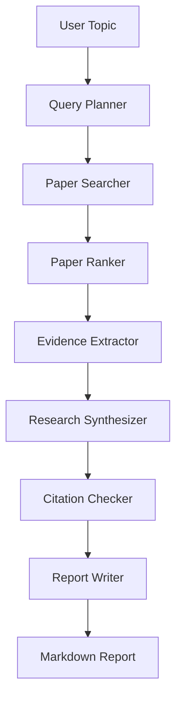

# ResearchFlow Architecture

本文件作为课程要求中的 `docs/architecture.md`，用于集中说明系统架构。更完整的选题分析、市场分析和创新点见 `docs/researchflow_analysis_architecture.md`；更规格化的设计见 `docs/architecture_spec.md`。

## 1. 架构摘要

ResearchFlow 采用 LangGraph 编排的多智能体架构，将文献调研拆分为检索规划、论文搜索、证据抽取、综合分析、引用校验和报告生成等节点。

系统重点解决三个问题：

- 文献检索过程可复现。
- 报告结论可追溯到论文证据。
- 长流程 Agent 执行可观测、可恢复、可评估。

## 2. 分层架构

```text
CLI/API Entry
→ ResearchGraph
→ Agent Nodes
→ Tool Layer
→ Storage and Memory
→ Evaluation
```

## 3. Agent 交互流程



## 4. 核心创新

- Evidence Ledger：先构建证据账本，再生成报告。
- Claim-Evidence Alignment：每个关键结论绑定证据项。
- Recoverable ResearchGraph：保存中间状态，失败后可恢复。
- Built-in Evaluation：将评估作为系统模块，而不是 Demo 后补充。
