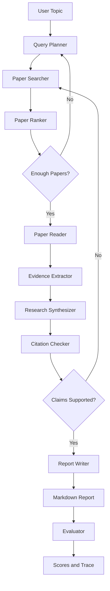
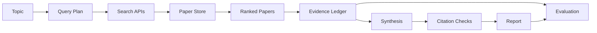

# ResearchFlow Architecture Spec

版本：v0.1  
日期：2026-06-05

## 1. 架构目标

ResearchFlow 的架构目标是构建一个可扩展、可恢复、可观测的多智能体文献调研系统。系统应将长流程调研任务拆成多个职责明确的 Agent 节点，并优先通过 LangGraph 状态图编排；当 LangGraph 依赖不可用时，系统使用同一节点契约的顺序 graph fallback，保证 Demo 稳定。

核心原则：

- 先检索和抽取证据，再生成报告。
- 所有关键结论必须能追溯到论文或证据项。
- 每个节点输入输出结构化，便于测试和恢复。
- 外部 API 调用必须支持缓存、限流和错误处理。

## 2. 总体分层

```text
CLI/API Entry
→ ResearchGraph Orchestrator
→ Agent Nodes
→ Tool Layer
→ Storage and Memory
→ Evaluation and Observability
```

| 层级 | 说明 |
| --- | --- |
| CLI/API Entry | 接收用户主题、Top-K、输出路径等参数 |
| ResearchGraph Orchestrator | 维护任务状态、节点路由、失败重试、trace 和 fallback |
| Agent Nodes | Query Planner、Searcher、Reader、Extractor、Synthesizer、Checker、Reporter |
| Tool Layer | arXiv、Semantic Scholar、OpenAlex、Crossref、PDF parser、Markdown writer |
| Storage and Memory | SQLite 存储任务、论文、证据、报告和 trace |
| Evaluation and Observability | 记录指标、节点日志、benchmark 结果 |

## 3. Agent 工作流



## 4. 核心组件

### 4.1 Query Planner

职责：

- 分析研究主题。
- 生成检索关键词、同义词和排除条件。
- 输出多组检索计划。

输入：

- `topic`
- `constraints`

输出：

- `query_plan`

### 4.2 Paper Searcher

职责：

- 根据检索计划调用论文 API。
- 合并多源候选论文。
- 保存原始检索结果。

工具：

- `search_arxiv`
- `search_semantic_scholar`
- `search_openalex`

输出：

- `searched_papers`

### 4.3 Paper Ranker

职责：

- 论文去重。
- 相关性排序。
- 年份、引用数、来源可信度过滤。

输出：

- `selected_papers`

### 4.4 Paper Reader

职责：

- 整理标题、摘要、作者、年份、链接等元数据。
- 对开放全文进行可选解析。
- 为证据抽取准备统一文本。

输出：

- normalized paper records

### 4.5 Evidence Extractor

职责：

- 提取研究问题、核心贡献、方法、实验设置、数据集、局限和未来工作。
- 生成 Evidence Ledger。

输出：

- `evidence_items`

### 4.6 Research Synthesizer

职责：

- 跨论文归纳主题。
- 构建方法对比表。
- 总结研究趋势和空白。
- 区分事实、综合判断和假设。

输出：

- `synthesis`

### 4.7 Citation Checker

职责：

- 校验论文实体是否真实存在。
- 检查报告结论是否有关联证据。
- 标记低可信引用。

输出：

- `citation_checks`

### 4.8 Report Writer

职责：

- 基于证据账本和综合结果生成 Markdown 报告。
- 只引用已通过候选论文白名单的文献。

输出：

- `report_markdown`

### 4.9 Evaluator

职责：

- 按 100 分制输出任务完成、检索质量、证据可信、报告质量和 Agent 行为得分。
- 生成 JSON 和 Markdown 评估结果。

输出：

- `metrics`

## 5. 状态模型

```python
class ResearchState(TypedDict):
    task_id: str
    topic: str
    constraints: dict
    query_plan: list[dict]
    searched_papers: list[dict]
    selected_papers: list[dict]
    evidence_items: list[dict]
    claims: list[dict]
    citation_checks: list[dict]
    report_markdown: str
    node_trace: list[dict]
    errors: list[dict]
    metrics: dict
```

设计规则：

- 节点只修改自己负责的字段。
- 所有外部工具调用结果都记录到状态或数据库。
- 错误写入 `errors`，由路由函数决定重试、降级或终止。
- `metrics` 用于记录耗时、数量、成功率等指标。

## 6. 数据模型

| 模型 | 字段摘要 |
| --- | --- |
| ResearchTask | task_id, topic, status, created_at, report_path |
| QueryItem | query_id, query_text, source, filters |
| PaperRecord | paper_id, title, authors, year, abstract, url, doi, arxiv_id, source |
| EvidenceItem | evidence_id, paper_id, category, claim, support_text, confidence |
| ClaimRecord | claim_id, claim_text, evidence_ids, claim_type |
| CitationCheck | check_id, paper_id, status, message |
| EvaluationResult | task_id, metric_name, value |

## 7. 数据流



## 8. 错误处理与降级

| 场景 | 策略 |
| --- | --- |
| 论文 API 超时 | 重试 2 次，失败后使用缓存或离线样例 |
| 检索结果过少 | 回到 Query Planner 扩展关键词 |
| LLM 输出 JSON 解析失败 | 触发格式修复 Prompt 或节点重试 |
| 引用校验失败 | 降级为低可信证据，不进入强结论 |
| 报告生成失败 | 保存中间 Evidence Ledger，允许重新生成 |

## 9. 可观测性

系统应记录：

- task_id
- node_name
- input_summary
- output_summary
- tool_calls
- elapsed_ms
- retry_count
- error_message

MVP 阶段以日志、JSON trace 文件和 Markdown 评估表为主，Final 阶段可扩展为可视化 trace。

## 10. 安全与合规

- API Key 只从环境变量读取。
- `.env` 不进入 Git。
- 报告中注明 AI 生成内容需人工复核。
- 引用外部论文和工具需在 README 或报告中标注。

## 11. 部署架构

MVP：

```text
Local Python CLI
→ LangGraph Runtime
→ Public Paper APIs / Offline Fixtures
→ Markdown Report
```

Final：

```text
Docker Container
→ CLI or FastAPI Service
→ LangGraph Runtime
→ SQLite + Cache
→ Public Paper APIs
→ Markdown/PDF Report
```

## 12. 扩展方向

- MCP server：将论文检索、证据抽取能力暴露给外部 Agent。
- Web UI：展示研究任务、证据账本和报告。
- Citation graph：构建论文引用网络。
- Alert Agent：定期追踪某研究主题的新论文。
- Human-in-the-loop：让用户审核候选论文和关键结论。
