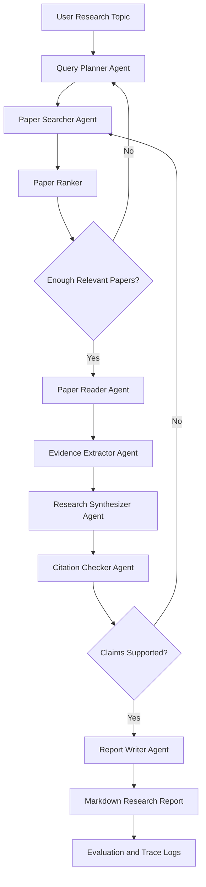
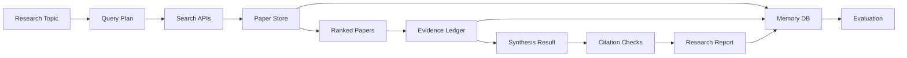

# ResearchFlow 选题分析与系统架构设计

制定日期：2026-06-05  
项目方向：方向一：Agentic AI 原生开发  
项目名称：ResearchFlow：证据可追溯的多智能体文献调研 Agent

## 1. 项目概述

ResearchFlow 面向研究生、科研初学者和需要快速了解技术领域的开发者。用户输入一个研究问题后，系统通过多智能体协作完成检索规划、论文检索、证据抽取、跨论文综合、引用校验和调研报告生成。

项目的核心设计思想是：文献调研 Agent 不应只生成“看起来完整”的文字，而应交付“可追溯、可复查、可复现”的研究证据链。

## 2. 市场分析

### 2.1 用户需求

文献调研是科研训练和技术决策中的高频任务。典型用户包括：

- 研究生：需要在短时间内进入新方向，完成开题、综述和实验设计。
- 科研人员：需要跟踪领域进展，梳理代表性工作和研究空白。
- 企业研发团队：需要快速判断某项技术路线是否成熟，形成技术调研报告。
- 教师和课程团队：需要辅助学生形成规范的文献调研流程。

这些用户的共同痛点是：

- 文献数量增长快，人工检索和筛选耗时。
- 初学者不熟悉领域关键词，容易漏掉关键论文。
- 大模型可以快速写综述，但可能生成虚假引用或无依据结论。
- 现有工具常偏向单点能力，例如搜索、摘要、图谱或问答，完整可复现的调研闭环仍有空间。

### 2.2 现有产品与工具

当前市场上已有一批 AI 学术研究工具：

| 工具 | 主要能力 | 对 ResearchFlow 的启发 |
| --- | --- | --- |
| Elicit | 语义搜索、系统综述、报告生成、数据抽取 | 说明“AI + 文献综述”已有明确需求，应重点差异化在可复现工作流与课程可实现性 |
| Consensus | 面向研究问题的证据搜索和摘要 | 说明用户希望得到带来源的答案，而不是普通聊天式回答 |
| SciSpace | 论文阅读、解释和写作辅助 | 说明单篇论文理解是文献调研的重要子任务 |
| Connected Papers / Research Rabbit | 论文关系图谱和相似论文探索 | 说明引用网络和主题聚类能帮助发现研究脉络 |
| Semantic Scholar / OpenAlex / arXiv | 学术元数据和论文检索 API | 为 ResearchFlow 提供可落地的数据入口 |

Elicit 官方信息显示，它已经支持大规模论文语义搜索、研究报告、系统综述和数据抽取，并在 2026 年推出 API 与 Research Agent 能力。这说明文献调研智能化已经从“辅助搜索”进入“可工作流化的研究 Agent”阶段。

### 2.3 市场机会

ResearchFlow 不与成熟商业工具正面竞争，而是聚焦课程项目可实现的差异化价值：

1. 开源、透明、可复现：展示每一步检索、筛选、抽取、综合和引用校验过程。
2. 面向 Agentic AI 教学：突出 LangGraph 状态流、多 Agent 协作、工具调用和评估。
3. 证据账本：每个报告结论都能回溯到具体论文元数据或摘要片段。
4. 可评估：提供 benchmark 任务和指标，而不是只展示一次漂亮 Demo。

## 3. 研究现状

### 3.1 AI 文献调研工具的发展

AI 文献调研工具已经从关键词搜索扩展到语义搜索、自动摘要、结构化数据抽取和报告生成。Elicit、Consensus、SciSpace 等产品证明了用户对“更快理解研究现状”的强需求。

但现有工具通常存在三类局限：

- 工作流黑盒：用户难以复现系统为什么选择这些论文、忽略哪些论文。
- 引用可信度不稳定：如果生成阶段脱离检索结果，可能出现虚假引用或错误归因。
- 可定制性不足：课程项目需要清晰展示 Agent 架构、状态流和工具接口，而商业产品通常不可见。

### 3.2 RAG 与 Agentic RAG 研究进展

RAG 通过检索外部知识来增强生成，适合处理文献调研中的知识时效性与证据来源问题。近年来研究开始从普通 RAG 走向 Agentic RAG，即由 Agent 自主规划检索、调用工具、反思结果并多轮补充证据。

对 ResearchFlow 来说，RAG 的价值不只是“把论文摘要塞进 Prompt”，而是建立以下机制：

- 检索规划：根据研究问题生成多组关键词、同义词和排除条件。
- 多源召回：从 arXiv、Semantic Scholar、OpenAlex 等来源获取候选论文。
- 证据抽取：将论文中的贡献、方法、实验、局限抽取为结构化字段。
- 引用约束生成：报告只能引用证据库中存在的论文。
- 结果反思：如果某一主题缺少证据，回到检索阶段补充搜索。

### 3.3 引用幻觉与可信生成问题

学术写作中最危险的问题之一是引用幻觉：模型可能生成真实感很强但不存在或元数据错误的参考文献，也可能把某篇论文没有说过的观点归因给它。

因此，ResearchFlow 不能只依赖 LLM 的自然语言能力，需要加入引用校验机制：

- 论文实体校验：标题、作者、年份、DOI、arXiv ID 是否能在外部数据源中查到。
- Claim-Evidence 对齐：报告中的关键结论是否至少对应一个证据片段。
- 不确定性标注：证据不足的观点必须标记为“待验证”，不能写成确定结论。

### 3.4 学术元数据基础设施

ResearchFlow 的可行性来自开放学术数据源：

- arXiv API 支持按查询式、ID 列表、分页和排序获取论文元数据，适合 AI/CS 方向的预印本调研。
- Semantic Scholar Academic Graph API 提供论文、作者、引用、相关论文等学术图谱数据。
- OpenAlex 提供开放的全球学术作品、作者、机构、期刊和概念图谱，适合做跨来源补充和元数据校验。
- Crossref REST API 可用于 DOI 和出版元数据校验。

这些数据源让项目可以在课程周期内实现一个可运行的 MVP，而不需要从零构建学术搜索引擎。

## 4. 核心问题

ResearchFlow 要解决的问题可以概括为：

```text
如何让 AI Agent 在给定研究主题后，生成一份结构化、可追溯、引用可信、过程可复现的文献调研报告？
```

拆解后包含五个子问题：

1. 如何把模糊研究主题转化为高质量检索计划？
2. 如何从多个论文数据源中召回并筛选高相关文献？
3. 如何从论文标题、摘要或开放全文中抽取可用于综述的证据？
4. 如何综合多篇论文，形成主题分类、方法对比和研究空白？
5. 如何校验报告中的引用和结论，降低幻觉风险？

## 5. 技术难点与解决方案

### 5.1 难点一：检索召回不足

问题表现：

- 用户输入往往是自然语言问题，不一定包含领域常用关键词。
- 单一关键词搜索容易漏掉同义表达和相关子方向。
- 不同数据源的检索逻辑和字段质量不同。

解决方案：

- 设计 Query Planner Agent，将研究主题拆成核心概念、同义词、相关方法、应用场景和排除条件。
- 对每个主题生成多组检索式，例如 broad query、method query、application query、recent trend query。
- 采用多源召回，先从 arXiv 获取近期论文，再用 Semantic Scholar/OpenAlex 补充引用和影响力信息。
- 对候选论文进行去重、年份过滤、主题相关性打分和 Top-K 筛选。

潜在创新点：

- “检索式组合账本”：保存每组检索式带来的论文集合，用于解释系统为什么找到这些文献。

### 5.2 难点二：引用幻觉与错误归因

问题表现：

- LLM 可能编造不存在的论文。
- LLM 可能把 A 论文的观点错误归因给 B 论文。
- 报告文字可能没有对应的证据来源。

解决方案：

- 所有报告引用必须来自 Paper Store 中的真实论文记录。
- Citation Checker Agent 对标题、作者、年份、DOI/arXiv ID 进行外部校验。
- Report Writer 只接收结构化 Evidence Ledger，而不是直接凭空写作。
- 对每个关键结论生成 claim_id，并关联 evidence_id。
- 对证据不足的结论进行降级表达，例如“现有候选文献显示”“需要进一步验证”。

潜在创新点：

- “Claim-Evidence Ledger”：把报告中的每个关键结论绑定到具体论文和证据字段，形成可检查的证据账本。

### 5.3 难点三：跨论文综合困难

问题表现：

- 单篇论文摘要容易，跨论文比较难。
- 不同论文使用不同术语描述相似方法。
- 研究空白往往需要从多篇论文的局限和未来工作中归纳。

解决方案：

- Evidence Extractor Agent 将论文信息统一抽取为结构化 schema。
- Synthesizer Agent 基于结构化证据做主题聚类、方法分类和对比表格。
- 使用 Reviewer Agent 检查综合结果是否覆盖主要主题、是否存在过度概括。
- 报告中明确区分“论文事实”“综合判断”和“系统推测”。

潜在创新点：

- “三层结论模型”：Fact、Synthesis、Hypothesis 分层生成，避免把推测写成事实。

### 5.4 难点四：长流程不稳定

问题表现：

- 文献调研包含多步工具调用，任何一步失败都会影响最终报告。
- 外部 API 可能限流、超时或返回不完整数据。
- LLM 输出格式可能不稳定。

解决方案：

- 使用 LangGraph 将流程建模为有状态图，而不是一次性长 Prompt。
- 每个节点都有明确输入输出 schema、重试策略和失败降级逻辑。
- 对外部 API 调用加入缓存、限流和超时控制。
- 中间结果写入 SQLite，支持中断后恢复。
- 报告生成前执行格式校验和引用校验。

潜在创新点：

- “可恢复研究流水线”：每次调研任务都保存阶段状态，失败后可以从 Search、Extract 或 Synthesize 节点恢复。

### 5.5 难点五：结果质量难评估

问题表现：

- 文献调研质量不仅取决于文字流畅度，还取决于相关性、覆盖度、引用准确性和结构完整性。
- 人工评分成本高，单次 Demo 难以证明系统可靠。

解决方案：

- 构建 benchmark 任务集，每个任务包含研究主题、期望关键词、参考核心论文或人工评分标准。
- 设计自动指标和人工指标结合的评估方式。
- 自动指标包括检索数量、去重率、Top-K 相关性、引用校验通过率、报告章节完整率。
- 人工指标包括主题覆盖、研究空白合理性、结论可信度。

潜在创新点：

- “调研报告质量评分器”：对报告进行结构完整性、证据密度、引用有效性和不确定性表达评分。

## 6. 项目目标

### 6.1 MVP 目标

在 2026-06-08 前完成：

- 命令行输入研究主题。
- 自动生成检索关键词。
- 从至少一个论文数据源获取候选论文。
- 生成包含核心论文、方法分类、研究空白和参考文献的 Markdown 报告。
- 每条关键结论至少能关联一个论文来源。

### 6.2 Final 目标

在 2026-06-22 前完成：

- 支持至少两个论文数据源。
- 支持 Citation Checker。
- 支持 SQLite 任务历史和论文缓存。
- 支持 benchmark 评估。
- 输出完整课程报告 PDF。
- GitHub 仓库结构完整，可公开访问。

### 6.3 长期目标

- 支持开放获取全文阅读和段落级证据引用。
- 支持研究主题持续追踪和新论文提醒。
- 支持可视化主题图谱和引用网络。
- 支持团队协作式调研任务。
- 支持 MCP 协议，将论文检索能力暴露给外部 Agent。

## 7. 系统架构设计

### 7.1 总体架构

ResearchFlow 采用分层架构：

```text
用户入口层
→ Agent 编排层
→ 专家 Agent 层
→ 工具调用层
→ 数据与记忆层
→ 评估与可观测层
```

各层职责：

| 层级 | 职责 |
| --- | --- |
| 用户入口层 | CLI 或 API 接收研究主题、参数和输出路径 |
| Agent 编排层 | 使用 LangGraph 管理状态流、条件分支、重试和恢复 |
| 专家 Agent 层 | Planner、Searcher、Reader、Extractor、Synthesizer、Checker、Reporter |
| 工具调用层 | arXiv、Semantic Scholar、OpenAlex、Crossref、PDF parser、Markdown writer |
| 数据与记忆层 | SQLite 保存任务、论文、证据、报告；向量库作为扩展 |
| 评估与可观测层 | 保存 trace、运行 benchmark、生成质量指标 |

### 7.2 Agent 协作流程



### 7.3 核心 Agent 设计

| Agent | 输入 | 输出 | 关键能力 |
| --- | --- | --- | --- |
| Query Planner | 研究主题、用户约束 | 检索计划、关键词组、过滤条件 | 主题拆解、同义扩展、检索策略 |
| Paper Searcher | 检索计划 | 候选论文列表 | 多源 API 调用、分页、限流、缓存 |
| Paper Ranker | 候选论文 | Top-K 论文 | 去重、相关性排序、年份和引用指标过滤 |
| Paper Reader | Top-K 论文 | 摘要/全文片段 | 元数据清洗、开放全文解析 |
| Evidence Extractor | 论文文本 | 结构化证据 | 贡献、方法、数据集、实验、局限抽取 |
| Synthesizer | 证据账本 | 主题分类、方法对比、研究空白 | 跨论文综合、聚类、对比 |
| Citation Checker | 论文元数据、报告草稿 | 引用校验结果 | DOI/arXiv ID 校验、Claim-Evidence 对齐 |
| Report Writer | 综合结果、校验结果 | Markdown 报告 | 引用约束写作、结构化输出 |
| Evaluator | 报告、trace、benchmark | 质量评分 | 相关性、覆盖度、引用有效性评估 |

### 7.4 ResearchGraph 状态设计

核心状态对象可设计为：

```python
class ResearchState(TypedDict):
    task_id: str
    topic: str
    constraints: dict
    query_plan: list[dict]
    searched_papers: list[dict]
    selected_papers: list[dict]
    evidence_items: list[dict]
    synthesis: dict
    citation_checks: list[dict]
    report_markdown: str
    errors: list[dict]
    metrics: dict
```

状态设计原则：

- 每个节点只读写自己负责的字段。
- 所有外部工具调用结果都进入状态或数据库，避免黑盒中间过程。
- errors 不立即终止流程，而是交给路由逻辑决定重试、降级或失败。
- metrics 贯穿全过程，用于最终评估和报告展示。

### 7.5 数据流设计



数据对象：

| 数据对象 | 说明 |
| --- | --- |
| ResearchTask | 一次调研任务，包含主题、参数、状态和输出路径 |
| PaperRecord | 论文元数据，包含标题、作者、年份、摘要、DOI、arXiv ID、来源 |
| EvidenceItem | 从论文中抽取的证据，包含贡献、方法、实验、局限、原文片段 |
| ClaimRecord | 报告中的关键结论，关联一个或多个 EvidenceItem |
| CitationCheck | 对论文实体和 Claim-Evidence 关系的校验结果 |
| ReportArtifact | 生成的 Markdown 报告和评估结果 |

## 8. 如何解决难点

ResearchFlow 的总体解决思路是把“生成式任务”拆成“可验证流水线”。

| 难点 | 架构应对 |
| --- | --- |
| 检索召回不足 | Query Planner 多检索式规划 + 多源召回 + Ranker 筛选 |
| 引用幻觉 | Citation Checker + Claim-Evidence Ledger + 报告引用白名单 |
| 跨论文综合困难 | 结构化 Evidence Schema + Synthesizer 聚类和对比 |
| 长流程不稳定 | LangGraph 状态机 + 节点重试 + SQLite 中间状态 |
| API 限流或失败 | 缓存、限流、离线样例、降级策略 |
| 质量难评估 | benchmark 任务集 + 自动指标 + 人工评分表 |

## 9. 创新点

### 9.1 证据账本驱动的调研报告

系统不直接让 LLM 从主题生成报告，而是先构造 Evidence Ledger。报告中的每个关键结论都必须引用 Evidence Ledger 中的证据，从而降低无依据生成。

### 9.2 Claim-Evidence 对齐校验

系统将报告拆成多个 ClaimRecord，并检查每个 claim 是否有足够证据支持。没有证据的 claim 会被删除、降级或标记为待验证。

### 9.3 可恢复的 ResearchGraph

文献调研被建模为 LangGraph 状态流。每一步都有可持久化状态，使系统可以从失败节点恢复，而不是一次失败导致整次调研作废。

### 9.4 三层结论模型

报告中的内容分为：

- Fact：单篇论文中的事实。
- Synthesis：多篇论文共同支持的综合判断。
- Hypothesis：由系统提出但证据不足的潜在研究方向。

这种分层可以帮助读者区分“论文已经证明的内容”和“系统推测的研究机会”。

### 9.5 评估内置而非事后补充

ResearchFlow 从设计阶段就把评估作为系统模块，包括检索相关性、引用有效性、证据覆盖度、报告完整性和 Agent 执行成功率。这样更符合 Agentic AI 工程实践，而不是只展示一次不可复现的 Demo。

## 10. 评估方案

### 10.1 功能测试

- 输入主题后能否生成检索计划。
- 能否调用论文检索工具并返回候选论文。
- 能否去重并筛选 Top-K。
- 能否生成结构化证据。
- 能否生成 Markdown 报告。
- 能否输出引用校验结果。

### 10.2 行为评估

| 指标 | 含义 |
| --- | --- |
| Search Success Rate | 检索工具调用成功率 |
| Top-K Relevance | Top-K 论文与主题的相关性 |
| Citation Validity | 引用元数据校验通过率 |
| Evidence Coverage | 报告关键结论中有证据支持的比例 |
| Report Completeness | 报告是否包含背景、论文列表、方法对比、研究空白、参考文献 |
| Recovery Rate | 节点失败后重试或降级成功率 |

### 10.3 Benchmark 任务

初始 benchmark 可包含以下主题：

1. Agentic RAG for enterprise knowledge management
2. Multi-agent collaboration in LLM systems
3. LLM agents for software engineering
4. Citation hallucination detection in scientific writing
5. Long-term memory mechanisms for LLM agents

每个任务保存：

- 输入主题
- 系统检索式
- 候选论文列表
- 最终报告
- 自动指标
- 人工评分

## 11. 与课程评分点的关系

| 评分项 | 本项目支撑材料 |
| --- | --- |
| 选题与设计思想 | AI 文献调研市场需求、引用幻觉问题、证据可追溯设计 |
| Specs 规格设计 | Product Spec、Architecture Spec、API Spec |
| 系统架构与设计 | ResearchGraph、Agent 协作图、数据流图、状态设计 |
| 关键实现与代码 | LangGraph 节点、工具定义、引用校验、报告生成 |
| 测试与评估 | benchmark、自动指标、Demo 输出 |
| 升级扩展设想 | MCP、全文阅读、研究主题追踪、引用网络 |
| 课程总结 | 从写代码转向编排智能体和设计可验证流程 |

## 12. 参考资料

- Elicit 官方网站：<https://elicit.com/>
- Semantic Scholar Academic Graph API：<https://www.semanticscholar.org/product/api>
- Semantic Scholar API 文档：<https://api.semanticscholar.org/api-docs>
- OpenAlex 官方网站：<https://openalex.org/>
- OpenAlex API 文档：<https://developers.openalex.org/api-reference/introduction>
- arXiv API 用户手册：<https://info.arxiv.org/help/api/user-manual.html>
- Crossref REST API 文档：<https://www.crossref.org/documentation/retrieve-metadata/rest-api/>
- LangGraph 多智能体文档：<https://langchain-ai.github.io/langgraph/agents/multi-agent>
- LangGraph durable execution 文档：<https://docs.langchain.com/oss/python/langgraph/durable-execution>
- Hallucination Mitigation for Retrieval-Augmented Large Language Models: A Review：<https://www.mdpi.com/2227-7390/13/5/856>
